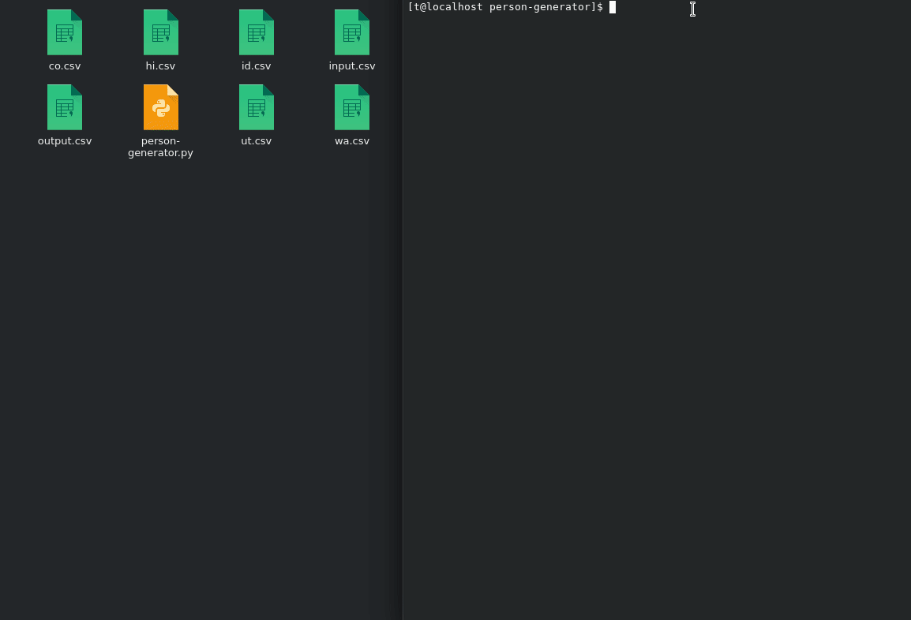

# CS361_Person_Generator_Microservice

## HOW TO RUN Person-Generator

### Video Walkthrough

To open GUI for Person-Generator, input in terminal:
  
    $ python3 person-generator.py
  

To run Person Generator in terminal, have a csv file in the same file location as the person-generator python file named "input.csv".
The csv file should have "input_state" (1st column) and "input_number_to_generate" (2nd column) in the first row in their respective columns. 
Additionally, the second row should have the state under input_state and the number of people to generate under "input_number_to_generate". 
Finally, input in terminal:

    $ python3 person-generator.py -i
